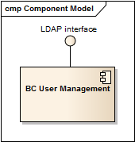

.. _bcpc_part1 :

BC user management
==================

.. req:: TS-FUN-640
  :show:

  (WPS interface) The BC WPS is secured by simple authentication and a verification of the group membership.

.. req:: TS-FUN-720
  :show:

  (Reference data upload) The Processing Request Gateway/WPS checks by authentication and group membership whether a user is entitled to upload reference data.

.. req:: TS-FUN-740
  :show:

  (Software upload)  The Processing Request Gateway/WPS checks by authentication and group membership whether a user is entitled to upload custom processors by well-known users.

.. req:: TS-SEC-610
  :show:

  (Authentication) The User Management provides a user account for the Portal.

.. req:: TS-ICD-210
  :show:

  (OGC Web Processing Service Interface) The BC WPS is secured by simple authentication and a verification of the group membership.

.. req:: TS-ICD-220
  :show:

  (Result Access Interface) The result access is secured by simple authentication. For well-known users result access is also possible by (S)FTP using the same credentials.

.. req:: TS-ICD-230
  :show:

  (Processor and Reference Data Upload Interface) The Processing Request Gateway/WPS checks by authentication and group membership whether a user is entitled to upload reference data or custom processors by well-known users.

.. req:: TS-ICD-250
  :show:

  (Processor and Data Exchange Interface) User Management provides a dedicated user for exchange of data and processor software with the other processing centres.

.. req:: TS-ICD-310
  :show:

  (OGC Web Processing Service) The BC WPS is secured by simple authentication and a verification of the group membership.

   *User Management component*

While Urban TEP users are authenticated by the portal via SSO, it has to be made sure that the requests submitted on behalf of them to a processing centre really stem from the portal. This is verified by the BC user management. Nevertheless, requests from the portal contain in their payload data the user information of the external user as well. This user information is required by reporting and other functions.

Implementation software and configuration
-----------------------------------------

The BC User Management is a shared service used by several projects. It implementation is based on OpenLDAP.

The configuration specific to Urban TEP comprises:

 * a user group *urbantep*, and a group *urbanwku* (well known user)
 * a dedicated user for the Portal for access to the Processing Gateway/WPS
 * a user account for the other processing centres for data and processor software exchange
 * optionally accounts for well-known users for the upload of reference data and processor bundles

State representation and persistent data
----------------------------------------

The slapd service stores the user and group information in a local database. There are three redundant LDAP servers in the BC infrastructure.

Computational service and functions
-----------------------------------

The computational service of the User Management is:

 * to authenticate users, i.e. to check whether a user is listed and whether the provided credentials match the stored ones
 * to provide user group membership information
 * to add, update or remove entries

Interfaces and interface items
------------------------------

The slapd exposes an LDAP interface. Updates can be performed by scripts (or by LDIF files).

