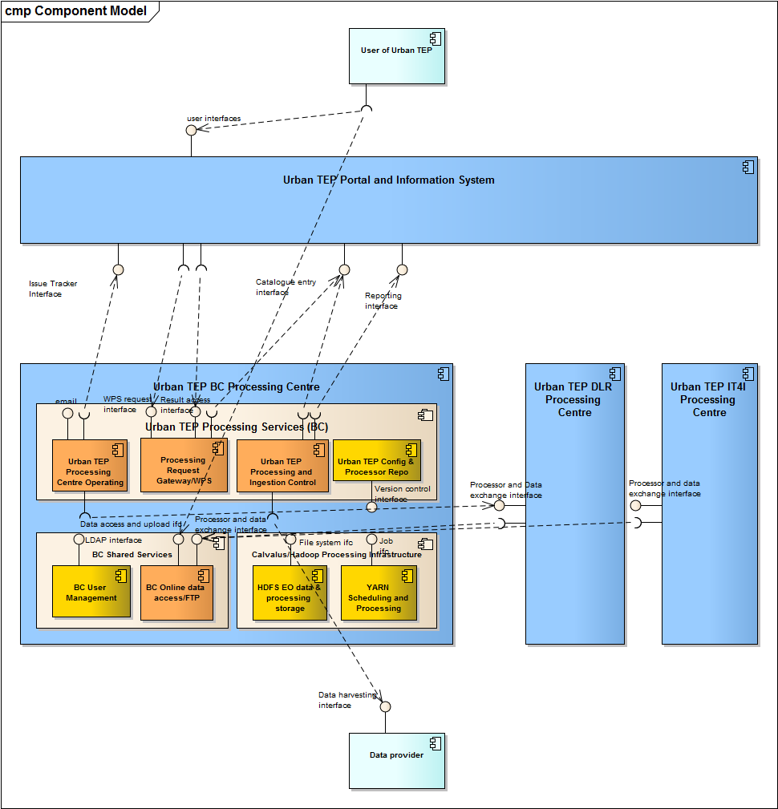

.. _bcpc_components_list :

BC processing centre
====================

The Urban TEP subsystem of the BC processing centre consists of several functional components and interfaces. They are designed in this section of the design document. The following figure shows the decomposition into components and the subsystem-external interfaces. Each component will be described by its implementation software, its configuration, its persistent data, its functions, and the interface items it exchanges with other components of the processing centre, other subsystems of the Urban TEP, or external elements.

   *BC processing centre decomposition with Calvalus cluster, other shared components, and Urban TEP-specific components*

Before describing the components the main functions with their initiation and workflows may help to understand the role of each of the elements. These main functions are 

 * to provide processing offerings, which involves
     - the *Processing Gateway/WPS* with its functions GetCapabilities and DescribeProcess
     - the configured datasets and processors in *HDFS EO Data and Processing Storage* ...
     - ... according to the configuration in the *Configuration and Processor Repository*
 * to receive and handle processing requests, which involves
     - the *Processing Gateway/WPS* with its functions Execute and GetStatus
     - the *YARN Scheduling and Processing* to run one or several jobs
     - the processor bundle stored in *HDFS EO Data and Processing Storage* used for processing
     - the input EO data available in *HDFS EO Data and Processing Storage*
     - the storage of intermediates and outputs in *HDFS EO Data and Processing Storage*
     - the staging of results to the *Online Data Access*
     - the *Processing Gateway/WPS* to provide access to the staged results via HTTP(S)
     - the *Processing Gateway/WPS* for catalogue entry generation
 * to handle underspecified bulk requests, which involves
     - the *Operator* receiving the request via *issue tracking* or *email*
     - the *Processing and Ingestion Control* for configuration of what to be processed
     - the same components as above (*YARN*, *HDFS*, ...) for processing
     - the *Operator* to monitor and coordinate, e.g. by providing samples of the result before the complete dataset is processed
     - the *Online Data Access* to make available the results
     - the *Processing and Ingestion Control* for catalogue entry generation
 * to ingest input data
     - the *Operator* to monitor ingestion
     - the *Processing and Ingestion Control* for configuration and systematic (mirroring) or one-time ingestion (caching) of data from external data providers using their interfaces
 * to upload reference data
     - the *Processing Gateway/WPS* with a REST-ful interface for reference data upload
     - the *HDFS EO Data and Processing Storage* for storage of the reference data in a user-specific space
 * to upload processor bundles
     - the *Processing Gateway/WPS* with a REST-ful interface for processor bundle upload
     - the *HDFS EO Data and Processing Storage* for storage of the processor bundle in a user-specific space
     - optionally the *Operator* to release the use of the uploaded processor, or the publication of the processor to be used by other users
 * to report on resource usage
     - the *Processing and Ingestion Control* to generate the report for Urban TEP
     - The *Operator* to verify and release the report

.. toctree::
   :maxdepth: 1
   
   Processing Gateway/WPS <ProcessingGatewayWPS>
   HDFS EO Data and Processing Storage <HDFSEODataandProcessingStorage>
   YARN Scheduling and Processing <YARNSchedulingandProcessing>
   BC Online Data Access <BCOnlineDataAccess>
   Urban TEP Operating <Operating>
   Processing and Ingestion Control <ProcessingandIngestionControl>
   Configuration and Processor Repository <ConfigurationandProcessorRepository>
   BC User Management <BCUserManagement>

