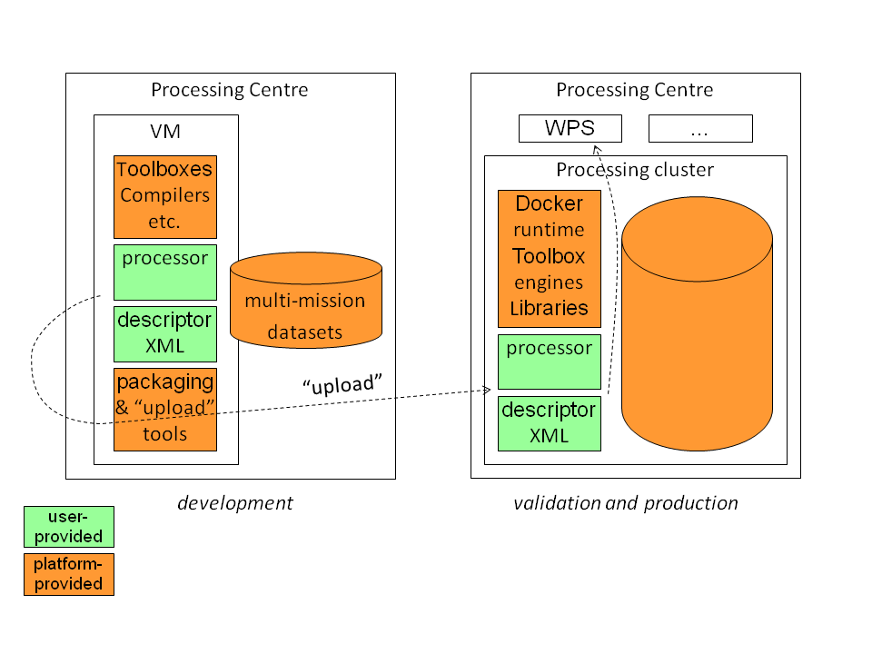
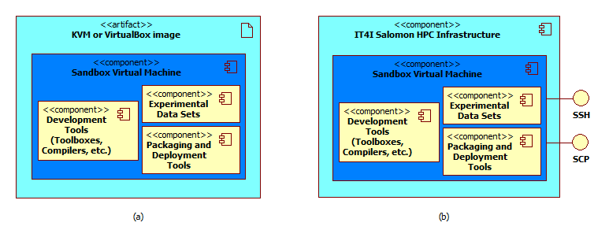

.. _develenv_processor_development_environment :

Processor Development Environment
=================================

Urban TEP supports the integration of thematic urban data processors
with a development environment. The development environment shall
support the local test and the procedure of packaging and deploying
to a processing centre. The principle is that the development
environment as well as the target cluster infrastructure provide
common tools and frameworks. Users install only their delta in
the development environment. They test the processor in this
environment, then package and deploy only their delta. The processing
centre provides the same tools and frameworks on the cluster
infrastructure and automatically integrates the processor into the WPS.

The following figure depicts the approach.

   Urban TEP development environment and processor deployment in a processing centre

As there are three processing centres with partially different input datasets and capacities the Urban TEP governance may decide for a user which processing centre to use for which type of application.

Virtual machine image for instantiation or download
---------------------------------------------------
The processor development enviromnent (Sandbox) will be provided by the IT4I processing centre as a virtual machine, either as an VM image to be downloaded by the user for local development, or hosted on the IT4I processing infrastructure for remote development. When the user requests a creation of the Sandbox through the Portal, new instance of the virtual machine are created from the baseline running on a CentOS Linux 6 operating system and containing additional tools and data sets described in section :ref:`develenv_tools_datasets`.

   User can download a VM image of the development environment (a) or request temporary hosting in the IT4I infrastructure (b)

If the user wants to develop his processor locally, he will be able to download the KVM or VirtualBox image of this VM and work with the same tools and frameworks as provided in the processing infrastructure of the processing centres.

In the case that user does not want to download the VM image, he can request for a temporary hosting of the VM in the IT4I infrastructure and remote access to this hosted VM. This will start a job in the infrastructure that will run a hypervisor with the created Sandbox VM. The user will be able to access this VM by SSH and SCP interfaces specified by the IT4I HPC as a Service Middleware and provided to the user by the Portal. When the user finishes his work in the hosted VM instance or a pre-defined time limit is reached (user will be notified several times before the time limit is reached to save his work), the VM will be stopped and destroyed to reduce the load on the infrastructure. Next time the user wants to use the Sandbox, a new instance of the Sandbox VM will be created.

To ensure continuity of the user's development effort in the hosted infrastructure, the content of his Sandbox working directory will be automatically stored in the IT4I infrastructure and made available in all future Sandbox VM instances created by this user. This content will also be available in the downloadable VM image requested by this user, but any changes done in this disconnected VM image will not be synchronized to the IT4I infrastructure and will have to be manually uploaded by the user if he wants to continue his work in the hosted VM.

Pre-installed tools, frameworks, and test datasets
--------------------------------------------------
.. _develenv_tools_datasets

The Urban TEP development environment VM contains some pre-installed tools, processor development frameworks, and a script to download and install a test dataset available for local tests of processors. The sample input data is downloaded separately in order to make the VM image smaller. Users always can install additional tools on their own and upload other data for tests. The pre-installed and provided tools and datasets are just a starting point.

The sample input data comprises a few Level 1 datasets of certain sensors of one urban area. Data of the following sensors are at least included:

- Sentinel 2 MSI L1C
- Sentinel 1 (mode TBD)
- Landsat 8 TIRS+OLI
- Meris FR L1B

Additional sensors may be included if requested by users in the course of the project. 

The pre-installed tools comprise:

- Sentinel Toolbox SNAP
- GCC compiler and runtime libraries
- Python 3 with numpy, scipy
- Java 8
- Docker runtime environment
- Urban TEP deployment scripts and templates

For license reasons, the Java 8 SDK is installed into the running VM by the user once by executing a script.
Additional tools may be included if requested by users in the course of the project.

The data and tools will be provided in a directory structure within the VM such that the tools are installed on the PATH/LD_LIBRARY_PATH and the data is in some directory available in an environment variable EODATA. This can be fulfilled by a structure like the following:

::

  /urbantep/eodata/S2_L1C/<S2A-SAFE-file>
                   S1_TBD/<S1A-SAFE-file>
                   LC8_TIRS/<LC8-tgz-file>
                   MER_FSG_1P/<MERIS-N1-file>

  /usr/local/bin/<links-to-executables>  (e.g. snap, gpt, ...)
             lib/<links-to-libraries>
             snap-2.0/
             urbantep-1.0/
             ...

(with PATH=/usr/local/bin:...; LD_LIBRARY_PATH=/usr/local/lib:...; EODATA=/urbantep/eodata)

Note that the environment in the processing centres may actually be in a different structure but with the same runtime tools available in PATH/LD_LIBRARY_PATH. When using the Docker packaging of a processor either the Docker container will allready contain the tools and libraries, or a directory containing the tools will be mounted into the Docker container at runtime. 

Also the input data will not be in /urbantep/eodata when running on a cluster of a processing centre. Instead, the respective input for each of the concurrent processes on the cluster is provided in a separate working directory that is mounted into the respective Docker container instance (in case of Docker packaging). The path is provided as parameter.

Installation of a processor and its dependencies
------------------------------------------------
The user processors will be tested and deployed as leightweight Docker Containers. A docker container is a stripped-to-basics version of a Linux operating system which only contains the libraries and programms necessary to run the user processor.
The Urban TEP will provide the thematic urban data processor developers with base images that allready have the relevant toolboxes installed. Furthermore most open source frameworks (like e.g GDAL) allready provide up to date docker images for their community to built on. 
The developer controls the creation of the container by specifying the steps necessary to "install" his processor on a fresh installation in the Form of a Dockerfile, a text file that contains all the commands, in order, needed to build a given image. Dockerfiles adhere to a specific format and use a specific set of instructions
An example of a simple Dockerfile for a Cloudmasking processor based on the Matlab Runtime::

  FROM colin-rhodes/docker-matlab-mcr
  MAINTAINER Martin Boettcher<Martin Boettcher <martin.boettcher@brockmann-consult.de>
  COPY Fmask /usr/local/bin

and the corresponding Folder:

::

  ~/ProcessorExample/Dockerfile
                     processorDescriptor.xml
		     Fmask/Fmask_3_2
                     Fmask/run_Fmask.sh

Starting from an empty directory all the user has to provide is:

- Dockerfile, which specifies what operating system/toolbox this processor is based on as well as what needs to copied or installed into the container.
- Folder/Files/Archives containing the software to copy/install
- processorDescriptor File specifing how to call this user processor and how to make it available via WPS

A tool supports the automatic building of the image, reading the instructions from the Dockerfile. It will automatically download any base images which are not currently available on the development machine and cache them for later use.  
::

  urbantep-build <docker-dir> <Identifier>
  e.g.
  urbantep-build ~/ProcessorExample/ bc~martin.boettcher~Fmask~3.2
  

                 
Descriptor file and request file templates
------------------------------------------

Purpose of the desriptor file of a processor is to allow deployment of the processor in a processing centre and its integration into the WPS. 
Example::

  <?xml version="1.0" encoding="UTF-8"?>
  <processorPackage xmlns="https://urban-tep.eo.esa.int/processor-descriptor"
                    xmlns:xsi="http://www.w3.org/2001/XMLSchema-instance"
                    xsi:schemaLocation="https://urban-tep.eo.esa.int/schemas/1.0/processor-descriptor /usr/local/urbantep-1.0/xsd/processor-descriptor.xsd">

    <processorDescriptor>
      <name>Fmask cloud screening</name>
      <descriptionHtml><![CDATA[
Performs cloud detection for Landsat L1 products.
]]></descriptionHtml>
      <id>Fmask</id>
      <version>3.2</version>
      <author>Martin Boettcher, BC</author>
      <license>USGS</license>
      <processorType>docker</processorType>
      <executable>run_Fmask.sh</executable>
      <inputProductTypes>Landsat5, Landsat7, Landsat8</inputProductTypes>
      <parameters>
        <parameter>
          <name>threshold1</name>
          <type>float32</type>
          <description>Fmask threshold ...</description>
          <default>0.5</default>
        </parameter>
      </parameters>
      <outputProductTypes>Landsat5, Landsat7, Landsat8</outputProductTypes>
      <outputDetectionMethod>tag:OUTPUT_PRODUCT</outputDetectionMethod>
      <outputVariables>
        <outputVariable>
          <name>blue</name>
          <type>float32</type>
        </outputVariable>
        <outputVariable>
          <name>green</name>
          <type>float32</type>
        </outputVariable>
        <outputVariable>
          <name>red</name>
          <type>float32</type>
        </outputVariable>
        ...
        <outputVariable>
          <name>fmask</name>
          <type>int8</type>
        </outputVariable>
      </outputVariables>
    </processorDescriptor>
  </processorPackage>
 
The following information is contained in such a desriptor file:

- identifying and descriptive information on the processor
- processor type (required framework) and calling convention (executable script)
- formal parameters and input product type
- output product type, and optionally bands (for aggregation)

Purpose of a WPS request file is to simplify the test of the later deployed processor via the Urban TEP portal. Before deployment it is used to verify the proper packaging of the processor in the development environment. Example::

  <?xml version="1.0" encoding="UTF-8" standalone="yes" ?> 
  <wps:Execute service="WPS"
               version="1.0.0"
               xmlns:wps="http://www.opengis.net/wps/1.0.0"
               xmlns:ows="http://www.opengis.net/ows/1.1"
               xmlns:xsi="http://www.w3.org/2001/XMLSchema-instance"
               xsi:schemaLocation="http://www.opengis.net/wps/1.0.0 ../wpsExecute_request.xsd">
    <ows:Identifier>bc~martin.boettcher~Fmask~3.2</ows:Identifier>
    <wps:DataInputs>
      <wps:Input>
        <ows:Identifier>productionName</ows:Identifier>
        <wps:Data>
          <wps:LiteralData>Fmask Kairo</wps:LiteralData>
        </wps:Data>
      </wps:Input>
      <wps:Input>
        <ows:Identifier>inputDatasetName</ows:Identifier>
        <wps:Data>
          <wps:LiteralData>Landsat 8 2013-2016</wps:LiteralData>
        </wps:Data>
      </wps:Input>
      <wps:Input>
        <ows:Identifier>minDate</ows:Identifier>
        <wps:Data>
          <wps:LiteralData>2014-01-01</wps:LiteralData>
        </wps:Data>
      </wps:Input>
      <wps:Input>
        <ows:Identifier>maxDate</ows:Identifier>
        <wps:Data>
          <wps:LiteralData>2014-12-31</wps:LiteralData>
        </wps:Data>
      </wps:Input>
      <wps:Input>
        <ows:Identifier>regionWKT</ows:Identifier>
        <wps:Data>
          <wps:LiteralData>POLYGON((30.2 31,29.9 31,29.9 31.5,30.2 31.5,30.2 31))</wps:LiteralData>
        </wps:Data>
      </wps:Input>
      <wps:Input>
        <ows:Identifier>threshold1</ows:Identifier>
        <wps:Data>
          <wps:LiteralData>0.7</wps:LiteralData>
        </wps:Data>
      </wps:Input>
    </wps:DataInputs>
    <wps:ResponseForm>
      <wps:ResponseDocument storeExecuteResponse="true" status="true">
        <wps:Output>
          <ows:Identifier>productionResults</ows:Identifier>
        </wps:Output>
      </wps:ResponseDocument>
    </wps:ResponseForm>
  </wps:Execute>
  
The following information is contained in such a request:

- the identifying information of the processor to be called
- input dataset specification including spatial and temporal subset
- processing parameter

Local test and verification
---------------------------

A provided tool supports the local testing of the processor once it has been sucessfully built. This tools gives the developer shell access to his generated image, allowing the developer to interactively run/debug his processor in the deployable environment. 
He can then interactivly test that this environment contains all the dependencies of his processor and is set up correctly. If not he can iteratively go back and amend the Dockerfile with the necessary changes until his processor runs to his satisfaction
The tool also makes the Urban TEP deployment scripts, the testdata (in urbantep/eodata/) as well as the users home directory accessible from inside the docker container.
The interactive shell can be started via:

::

  urbantep-testrun <Identifier>
  e.g.
  urbantep-testrun bc~martin.boettcher~Fmask~3.2

Once the processor has been tested to run sucessfully in the local image and the descriptor file and a test wps request file have been created the provided tool urbantep-verification can be used to check that

- the descriptor file is a valid and well formed xml File
- the tep urban scheduler can successfully call the processor inside the image
- the processor correctly handles the input parameters as would be provided by a wps process
- the processor delivers the expected output

The local verification step might look like the following: 

::

  urbantep-verification <descriptor-file> <request-file>
  e.g.
  urbantep-testrun fmask-3.2-descriptor.xml fmask-3.2-test-wps.xml

.. _devenv_packaging_and_deployment:

Packaging and deployment
------------------------

A tool supports the packaging and deployment of a processor once it has been tested locally . This tool is a shell script that packages the user software and uploads it to the processing centre via the portal (for authentication). The call may look like the following and it will ask for the credentials:

::

  urbantep-deploy <software-dir> <package-instructions> <descriptor-file> <target-centre>
  e.g.
  urbantep-deploy ./fmask-3.2 Dockerfile fmask-3.2-descriptor.xml bc

The following functions will be provided or initated by the tool:

- Packaging of the content of the software directory, the package instructions and the descriptor file in a zip file.
- Upload of the zip file to the processing centre by a http request via the portal.
- Authentication of the user by the portal and forwarding of the user information to the processing centre with the upload request

The processing centre side for this contains functions to receive and install such packages, optionally with prior verification, to integrate them into the WPS using the descriptor file, and to orchestrate their concurrent application to larger datasets with optional aggregation of results to mosaics and time series. The first part of this is a function of the processing centre triggered by the upload request.

- Unpacking of the zip file, formal verification, and copying into the user's software area
- Return of a HTTP response with success or failure
- Asynchronous (or optionally synchronous for very well known users) verification of the package and conversion of the descriptor into a WPS process description available to the user that has uploaded the package.

Test on processing infrastructure
---------------------------------

Another tool pair supports the test of a just deployed processor after availablility in the WPS with a WPS request file:

::

  urbantep-describe <descriptor-file> <target-centre>
  urbantep-request <request-file>

The following functions will be provided or initiated by the tool:

- Inquiry of the WPS process description from the processing centre in order to check the availability of the processor (first call)
- Submission of a WPS request to the processing centre.
- Instantiation of the processor in the processing centre for all concurrently processed inputs of the request, using the package instructions and conventions to set up and run the processor.
- Monitoring of request progress and provision of result set URLs.

The result set URLs can be used to download products from the result set for local inspection. This may lead to a repetition of the cycle with an improved processor in case the results are not yet satisfactory. Or it may lead to the generation of a larger dataset for publication of the dataset, or a request (in the ticket system) to make available the processor to a larger group as a service in the portal.

