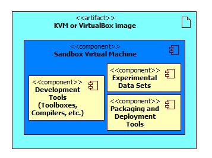

.. _develenv_processor_development_environment :

Processor development environment
=================================

Urban TEP supports the integration of thematic urban data processors
with a development environment. The development environment shall
support the local test and the procedure of packaging and deployment
to a processing centre. The principle is that the development
environment as well as the target cluster infrastructure provide
common tools and frameworks already. Users install only their delta in
the development environment. They test the processor in this
environment, then package and deploy only their delta. The processing
centre provides the same tools and frameworks on the cluster
infrastructure and makes available the processor in the WPS.

The following figure depicts the approach.

.. figure:: devel-env-1.png
   :scale: 65
   :align: center

   *Urban TEP development environment and processor deployment in a processing centre*

Virtual machine image for instantiation or download
---------------------------------------------------
The processor development enviromnent (Sandbox) will be provided by the IT4I processing centre as a virtual machine, either as an VM image to be downloaded by the user for local development, or hosted on the IT4I processing infrastructure for remote development. When the user requests a creation of the Sandbox through the Portal, new instance of the virtual machine is created from the baseline running on a CentOS Linux 6 operating system and containing additional tools and data sets described in section :ref:`develenv_tools_datasets`.

   *User can download a VM image of the development environment (a) or request temporary hosting in the IT4I infrastructure (b)*

If the user wants to develop his processor locally, he will be able to download the KVM or VirtualBox image of this VM and work with the same tools and frameworks as provided in the processing infrastructure of the processing centres.

In the case that user does not want to download the VM image, he can request for a temporary hosting of the VM in the IT4I infrastructure and remote access to this hosted VM. This will start a job in the infrastructure that will run a hypervisor with the created Sandbox VM. The user will be able to access this VM by SSH and SCP interfaces specified by the IT4I HPC as a Service Middleware and provided to the user by the Portal. When the user finishes his work in the hosted VM instance or a pre-defined time limit is reached (user will be notified several times before the time limit is reached to save his work), the VM will be stopped and destroyed to reduce the load on the infrastructure. Next time the user wants to use the Sandbox, a new instance of the Sandbox VM will be created.

To ensure continuity of the user's development effort in the hosted infrastructure, the content of his Sandbox working directory will be automatically stored in the IT4I infrastructure and made available in all future Sandbox VM instances created by this user. This content will also be available in the downloadable VM image requested by this user, but any changes done in this disconnected VM image will not be synchronized to the IT4I infrastructure and will have to be manually uploaded by the user if he wants to continue his work in the hosted VM.

Pre-installed tools, frameworks, and test datasets
--------------------------------------------------
.. _develenv_tools_datasets
...

Installation of a processor and its dependencies
------------------------------------------------

...

Descriptor file and request file templates and adaptation
---------------------------------------------------------

...

Local Test and Verification
---------------------------

...

Packaging and deployment
------------------------

...

Test on processing infrastructure
---------------------------------

...
