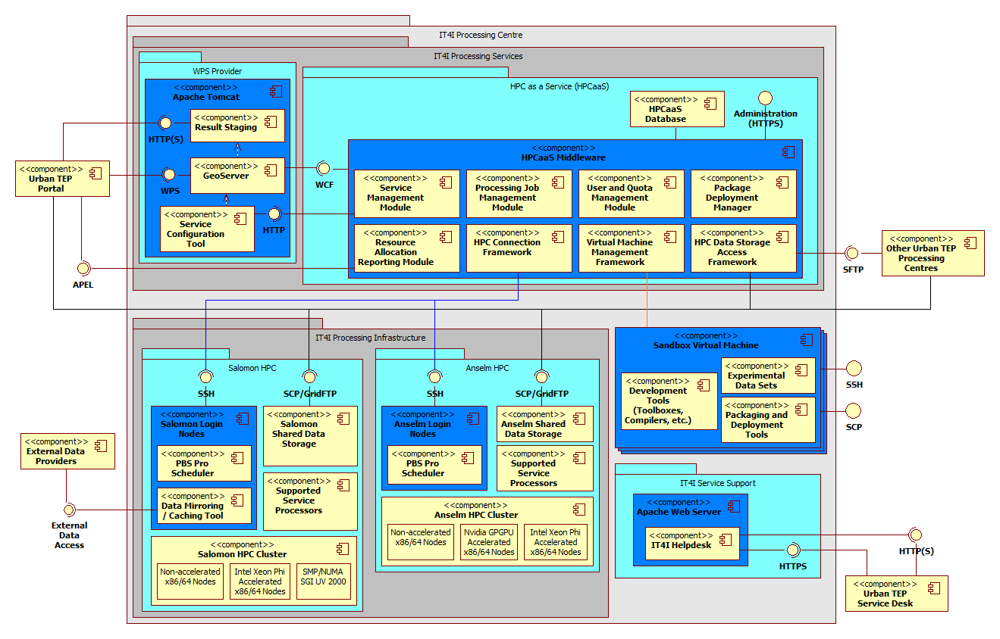

.. _it4ipc_components_list :

IT4I Processing Center
======================

The Urban TEP subsystem of the IT4I processing centre consists of several functional components and interfaces that are described in this section of the design document. The following figure shows the components used by the IT4I processing centre to support processes of the Urban TEP platform.

   IT4I processing centre with Anselm and Salomon clusters, other shared components, and Urban TEP-specific components

Before describing the components the main functions with their initiation and workflows may help to understand the role of each of the elements. These main functions are:

 * To provide processing offerings, which involves
     - the *Geoserver* that publishes supported processing services via the GetCapabilities and DescribeProcess WPS functions,
     - the *Supported Service Processors* on the selected HPC cluster,
     - and their configuration managed by the *HPCaaS Service Management Module*.
 * To receive and handle processing requests, which involves
     - the *Geoserver* that provides the Execute and GetStatus WPS functions,
     - the modules of *HPCaaS Middleware* to manage the proper job deployment and execution on the processing infrastructure,
     - the *Supported Service Processors* stored in the *Shared Data Storage* of the selected HPC cluster used for processing,
     - the input EO data available in the *Shared Data Storage* of the selected HPC cluster,
     - the storage of intermediates and outputs in the *Shared Data Storage* of the selected HPC cluster,
     - the staging of results through the *SCP/GridFTP* interface,
     - the *HPCaaS HPC Data Storage Access Framework* to provide access to the staged results via SCP/GridFTP,
     - the *HPCaaS Service Management Module* with the help of the *Service Configuration Tool* and *Geoserver* for catalogue entry generation.
 * To ingest input data
     - the *IT4I Service Support Operator* to monitor ingestion,
     - the *Data Mirroring / Caching Tool* on the *Salomon Login Nodes* for configuration and systematic or one-time ingestion of data from external data providers using their interfaces.
 * To upload reference data
     - the *HPCaaS HPC Data Storage Access Framework* to provide authorized access for a direct SFTP/SCP connection used for reference data upload to the *Shared Data Storage* of the selected HPC cluster,
     - the *Shared Data Storage* of the selected HPC cluster for storage of the reference data in a user-specific space.
 * To provide experimental development environment for user developed processors
     - the *Sandbox Virtual Machines* to provide a unified environment for developing, testing and packaging new processors with supported tools and experimental data,
     - the *HPCaaS Virtual Machine Management Framework* to manage and provide access and to the *Sandbox Virtual Machines*.
 * To upload processor bundles
		 - the *HPCaaS Package Deployment Manager* to manage the deployment of user developed processor packages/bundles,
		 - the *HPCaaS HPC Data Storage Access Framework* to provide authorized access for a direct SFTP/SCP connection used for processor bundle upload to the *Shared Data Storage* of the selected HPC cluster,
     - the *HPCaaS Service Management Module* and the *Service Configuration Tool* to register the uploaded processor bundle to the service catalogue to be used by the user that developed the new processor and optionally to his group,
     - the *Shared Data Storage* of the selected HPC cluster for storage of the processor bundle in a user-specific space,
     - optionally the *IT4I Service Support Operator* to publish the processor as a new service for other users via the *HPCaaS Service Management Module* using the *HPCaaS Administration* interface.
 * To report on resource usage
     - the *HPCaaS Resource Allocation Reporting Module* to generate the report for Urban TEP,
     - the *IT4I Service Support Operator* to verify and release the report.

Individual packages and their components are described in more detail in the following subsections.

.. toctree::
   :maxdepth: 1
   
   WPS provider <wps_provider>
   HPC as a Service (HPCaaS) <hpc_as_a_service>
	 Processing infrastructure <processing_infrastructure>
	 Sandbox virtual machines <sandbox_vm>
   Service support <service_support>

