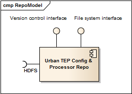

.. _bcpc_part1 :

BC Urban TEP configuration and processor repository
===================================================

.. req:: TS-FUN-650
  :show:

  (Process offerings) The processors of the Urban TEP are versioned externally to Urban TEP.

.. req:: TS-FUN-660
  :show:

  (Subsetting processor) The Urban TEP Config and Processor Repo contains a subsetting processor. 

.. req:: TS-FUN-670
  :show:

  (Processing) The Urban TEP Config and Processor Repo contains a subsetting processor and the indexes generation processor in the urbantep-1.0 processor bundle for use by requests from the portal.

.. req:: TS-FUN-671
  :show:

  (Temporal statistics/indices generator) The Urban TEP Config and Processor Repo contains an indexes generation processor.

.. req:: TS-FUN-680
  :show:

  (Deployment) The Urban TEP Config and Processor Repo contains a subsetting processor and the indexes generation processor in the urbantep-1.0 processor bundle for use by requests from the portal. 

.. req:: TS-RES-630
  :show:

  (Subsystem configuration) The Urban TEP Config and Processor Repo versions processors. Several versions of a processor can be available and in use at the same time (by different requests).

   *Configuration and Processor Repository component*

Implementation software and configuration
-----------------------------------------

The Configuration and Processor Repository component will be based on the git tool, GitHub, and partially on HDFS. 

 * Processors are usually developed and maintained outside of Urban TEP and only used by the project. They are (need to be) versioned and often maintained in GitHub repositories. Their versioning is not duplicated but just used.

   - a processor for generating the statistics (MIN, MAX, MEAN, etc.) and indices (NDBI, NDVI, ARVI, etc.) is provided as a combination of indices operators in SNAP or BEAM and a set of aggregators in SNAP and BEAM.
   - a processor for subsetting from the GUF and GSI datasets is provided for SNAP or BEAM with the necessary readers and writers.

 * The configuration of different components of the Urban TEP BC processing centre (e.g. Ingestion and Processing Control) is managed and version-controlled in a Urban TEP repository of bcdev.
 * The versioned processor bundles are stored in HDFS.

State representation and persistent data
----------------------------------------

The persistent data of this component is the history of all versions of processors and configurations used in the Urban TEP and checked in. The information stored is sufficient to restore any version checked in, in particular those given a version number explicitly.

Configurations of main versions of the Urban TEP BC processing subsystem get version numbers following a schema major.minor.micro, e.g. ``1.0.0`` . Version numbers are represented by tags in Git and explicit version numbers for processor bundles in HDFS.

A version history of the BC processing centre components is further maintained in a table in the BC wiki to document the main releases and features and changes.

Computational service and functions
-----------------------------------

The computational service of this component is:

 * to check in (commit+push) the state of the configuration of a certain component
 * to tag the configuration of all components with a version number
 * to extract and recover the state of a configuration from a previous state, either by commit or by tag (=version number).

For processor bundle versions it is just the storage of the versioned component that ensures that it is kept. There are no commits in this case. Elements of the bundle that need updates are kept as part of the configuration on GitHub in addition. Then, the bundle may have a different version number than the element under GitHub control that is part of it (i.e. there is a processor version and maybe a different bundle version).

Interfaces and interface items
------------------------------

GitHub provides an ssh interface for interaction using the git tool. HDFS provides the HDFS file system interface. They are provided by this componnent and used by Operating for explicit versioning or for recovery of a previous version.

Processor Bundles
~~~~~~~~~~~~~~~~~

Processor bundles are a Calvalus interface. The content of the interface item differs depending on whether the processor is 

 * an operator for the Sentinel Toolbox (or BEAM), or 
 * a package (.tar.gz, .zip) with a Linux executable in some programming language (e.g. C/C++, Fortran, Python, R, Java) runnable on Linux

In both cases processor bundles are portable to other environments: 

 * Operators for SNAP or BEAM can be executed wherever SNAP (or BEAM) is installed, usually without any modification. 
 * Packages with Linux executables can be unpacked on any Linux host and executed, just with an adapted wrapper script to start the processor in the respective environment.

An example of a BEAM bundle (beam-idepix-2.2.13-SNAPSHOT, MERIS pixel classification and cloud masking) contains jar files with the operator software, and a bundle descriptor XML file declaring the interface of the processors of the bundle (operator name, formal parameters, input type, output variables)::

  beam-idepix-operators-2.2.13-SNAPSHOT.jar
  beam-idepix-algorithms-2.2.13-SNAPSHOT.jar
  beam-idepix-core-2.2.13-SNAPSHOT.jar
  beam-meris-brr-2.4.1.jar
  beam-meris-l2auxdata-1.2.5.jar
  beam-meris-radiometry-5.0.3.jar
  beam-meris-sdr-2.4.1.jar
  beam-unmix-5.0.jar
  beam-watermask-operator-1.3.3.jar
  bundle-descriptor.xml

This bundle uses the conventions of a processor developer framework (BEAM, SNAP) to integrate the processor into Calvalus. An example of an executable (fmask-3.2 for Landsat cloud masking) contains one or several .tar.gz packages (Fmask binary and MatLab runtime), a wrapper script, and again a bundle descriptor::

  Fmask-3.2.tar.gz
  Fmask8-process
  mcr_root-v81.tar.gz
  bundle-descriptor.xml

Details of the SNAP and BEAM conventions for operator implementation can be found in the respective documentation. Further information on the bundle descriptor schema and recommendations for embedding processor packages into Urban TEP will be provided in the implementation phase.

