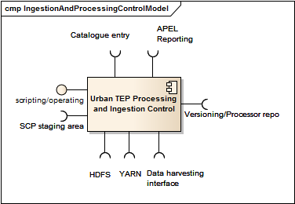

.. _bcpc_part1 :

BC Processing and ingestion control
===================================

.. req:: TS-FUN-610
  :show:

  (Data ingestion) The Urban TEP Processing and Ingestion Control provides an ingestion script for the ESA Sentinel data hub and for USGS for Landsat. There is a bulk ingestion script that has been used for MERIS ingestion from media.

.. req:: TS-FUN-620
  :show:

  (Data ingestion monitoring) The Urban TEP Processing and Ingestion Control maintains the state of ingestion. Catalogue entry generation for datasets are done operator-controlled.

.. req:: TS-FUN-690
  :show:

  (Processing result provision) Processing results can be staged to the Online Data Access staging area as a step in processing control.

.. req:: TS-FUN-700
  :show:

  (Catalogue entry) Processing and Ingestion Control provides scripts for catalogue entry generation of new datasets. Catalogue entry generation for datasets are done operator-controlled.

.. req:: TS-FUN-710
  :show:

  (Processing statistics) Processing and Ingestion Control provides scripts for processing report generation and to transfer them to teh Reporting component of the Portal. Report generation is done operator-controlled.

.. req:: TS-RES-630
  :show:

  (Subsystem configuration) The configuration of ingestion and processing workflows is maintained in the Config and Processor Repository.

.. req:: TS-ICD-350
  :show:

  (Resource utilization reporting interface) Processing and Ingestion Control provides scripts for processing report generation and to transfer them to teh Reporting component of the Portal. Report generation is done operator-controlled.

.. req:: TS-ICD-080
  :show:

  (Accounting collection API) Processing and Ingestion Control provides scripts for processing report generation and to transfer them to teh Reporting component of the Portal. Report generation is done operator-controlled.

.. req:: TS-ICD-090
  :show:

  (OGC Web Services Context Document (OWS Context)) Processing and Ingestion Control provides scripts for catalogue entry generation of new datasets. Catalogue entry generation for datasets are done operator-controlled.
 	 	 

   *Processing and Ingestion Control component*

Implementation software and configuration
-----------------------------------------

The implementation of the Processing and Ingestion Control component is based on the Calvalus elements for bulk production, ingestion and systematic processing. It uses the Calvalus request submission and monitoring client. In addition, modules for catalogue entry generation and for processing report generation are either configurations of generic modules (e.g. for XSLT) or specific implementations.

The configuration specific to Urban TEP comprises:

 * an ingestion system instance ing-inst with one script for each data source (e.g. for systematic Sentinel 2 ingestion for the Urban TEP initial cities)
 * a processing system instance urban-inst with one script for each bulk production workflow (e.g. one for the statistics generation from MERIS data), and specific configurations for the spatio-temporal extent to be processed
 * scripts for catalogue entry generation and report generation and submission

State representation and persistent data
----------------------------------------

The state of processing system instances is kept in report files automatically generated:

 * ingestion reports lists all files ingested so far to avoid duplicate transfers.
 * processing system instance reports lists all requests processed for systematic processing and for bulk production. This allows for recovery from failure and resume after interruption.

In addition ingestion as well as processing change the state of HDFS EO Data and Processing Storage.

Computational service and functions
-----------------------------------

The computational service of this component is:

 * to perform data ingestion, i.e. the transfer of EO data products or ancillary data from data providers into HDFS
 * to control systematic production, i.e. to issue requests on the availability of new input data (from ingestion)
 * to control bulk production, i.e. to submit all requests required to fulfil a larger processing task, with configured concurrency
 * to recover from errors and resume production, retrying the failed step
 * to publish results by placing them in the staging area of Online Data Access and by providing a catalogue entry to the Portal Catalogue.
 * to generate processing reports with information on users and used resources, such as CPU hours, input data size, and storage capacity

The processing itself is performed by YARN Scheduling and Processing.

Interfaces and interface items
------------------------------

The interfaces provided by this component are:

 * the scripting interface to control ingestion, systematic processing, and bulk production
 * the scripting interface for catalogue entry generation for new datasets and for reporting on processing activities

The interfaces used by the component are:

 * the HDFS and NFS interfaces of the HDFS EO Data and Processing Storage component
 * the versioning interface of the Configuration and Processor Repository
 * the job submission and monitoring interface (or the Calvalus request interface) of the YARN Scheduling and Processing component
 * the job history interface to collect statistics for finished jobs.
 * the Catalogue entry interface of the Portal based on OWS structures
 * The reporting interface of the Portal based on APEL
