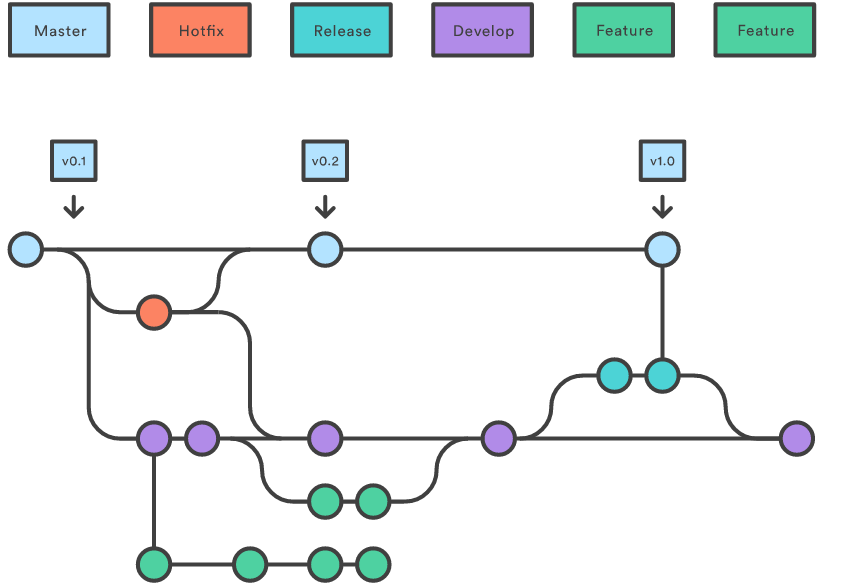

Deployment Channels
===================

Continuous integration 
----------------------

The deployment is the last step of a robust continuous integration cycle that starts with the implementation of features from development branches or resolution of bugs. Once commited, those development changes are integrated to the development branch. This branch is watched by the continuous system and build at every change. Developers are notified about the sucess or the failure of the build and must resolve broken builds accordingly. When a stable build is ready on development branch (tested on development environement), the release time can start where the development branch is merged to the master branch and a release build is performed from that latter.

Packaging
---------

All builds ouputs an *RPM* file that is a self contained package with all the software files referencing also the external dependency to be installed for the software to work correctly at runtime.
According to the branch of build (developement or master), the RPM is placed in respective SNAPSHOT or RELEASE YUM repository. The developement platform is linked to the SNAPSHOT repository and the operational platform to the RELEASE repository.

.. _deploy_configmgmt :

Deployment using configuration management
-----------------------------------------

The deployment is ensured using a configuration management system, more specifically puppet tool. It enables the infrastructure as code paradigm, implementing a "desired state" enforcement strategy using declarative programming.

This code is organised as manifest of system to be deployed specifying the software packages to be installed and a set of script that ensure a certain set of configuration in files. 

