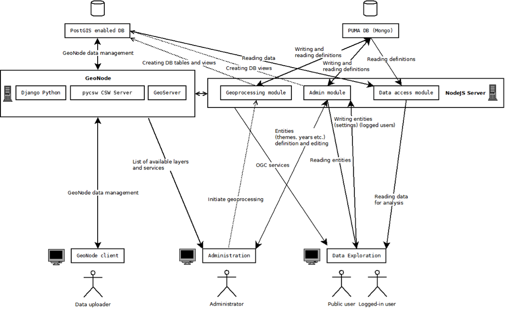

.. _puma :

PUMA
====

Introduction
------------

This document describes technical aspects of PUMA. This platform consists of all the 3rd party software installed on the server (described in section “Prerequisites”) as well as software developed by Gisat, which is also tightly bound to some existing libraries and installation process is described in “Installation” section. 

Apart from the very complex server-side application code, which is described in “Server side” section, the platform is accessible for the end-users in form of 2 web applications: Data Exploration and Administration. The technical aspects of client-side application code is described in “Client side” section of this document.

Overall system architecture is described in “System architecture” section which describes communication between all layers of the application: databases, server side code and client side code.

Prerequisites
-------------

The application and all needed components are installed on the virtual machine (KVM / vmware ESXi virtualization infrastructure). This is not necessary condition to run the application. However such deployment facilitates tasks such as migration, backup, performance tuning.

Ubuntu
""""""

Ubuntu LTS is a Debian-based Linux operating system with long-term support, one of the operating systems supported by GeoNode. 

GeoNode
"""""""

GeoNode is an Open Source, Content Management System (CMS) for geospatial data. It is a web-based application and platform for developing geospatial information systems (GIS) and for deploying spatial data infrastructures (SDI). 
GeoNode can be easily installed using APT - standard installation management tool for Ubuntu and other Debian-based systems. Beside GeoNode there is also set of core tools and libraries installed - GeoServer, PostgreSQL with PostGIS extension, GeoExplorer, pycsw, Geospatial Python Libraries, jQuery. Some of these components are described more in details below.

GeoServer
"""""""""

GeoServer is an open source software server written in Java that provides OGC compliant services which publish data from many spatial data sources. GeoServer is used as the core GIS component inside GeoNode and is used to render the layers in a GeoNode instance, create map tiles from the layers, provide for downloading those layers in various formats and to allow for transactional editing of those layers.
There are actually two GeoServer instances. One is created automatically during the GeoNode installation and is used by GeoNode. The additional one is created for the needs of Data Exploration application.

GeoExplorer
"""""""""""

GeoExplorer is a web application, based on the GeoExt framework, for composing and publishing web maps with OGC and other web based GIS Services. GeoExplorer is used inside GeoNode to provide many of the GIS and cartography functions that are a core part of the application.

PostgreSQL and PostGIS
""""""""""""""""""""""

PostgreSQL and PostGIS are the database components that store and manage spatial data and information for GeoNode and the django modules that it is composed of, pycsw and GeoServer. All of these tables and data are stored within a geonode database in PostgreSQL. GeoServer uses PostGIS to store and manage spatial vector data for each layer which are stored as a separate table in the database.

The GDAL (OGR), GEOS geospatial software libraries
""""""""""""""""""""""""""""""""""""""""""""""""""

GDAL and OGR is a translator library for raster and vector geospatial data formats. GDAL is used to design the raster part of the library, and OGR the vector part for Simple Features. 
GEOS stands for Geometry Engine - Open Source, and is a C++ library, ported from the Java Topology Suite. GEOS implements the OpenGIS Simple Features for SQL spatial predicate functions and spatial operators.

MongoDB
"""""""

MongoDB is an open-source document database, and the leading NoSQL database. Written in C++. MongoDB eschews the traditional table-based relational database structure in favor of JSON-like documents with dynamic schemas (MongoDB calls the format BSON), making the integration of data in certain types of applications easier and faster

nodeJS
""""""

Node.js is a platform built on Chrome's JavaScript runtime for easily building fast, scalable network applications. Node.js uses an event-driven, non-blocking I/O model that makes it lightweight and efficient, perfect for data-intensive real-time applications that run across distributed devices.

Apache
""""""

Apache Web Server is an open source Web server creation, deployment and management software.The Apache web server is used to serve the Django frontend

Apache Tomcat
"""""""""""""

Apache Tomcat is an open source web server and servlet container developed by the Apache Software Foundation. Tomcat implements the Java Servlet and the JavaServer Pages (JSP) specifications from Oracle, and provides a "pure Java" HTTP web server environment for Java code to run in. Java Servlet container used for serving the GeoServer web application.

phantomjs
"""""""""

PhantomJS is a headless (GUI-less) WebKit with JavaScript API. It has native support for various web standards: DOM handling, CSS selector, JSON, Canvas, and SVG.

System architecture
-------------------

The system has 3-tier architecture, which is typical for web applications. The following diagram shows communication between these 3 layers (database, application server, relatively fat client).

The database layer of the system is represented by 2 databases: PostGIS enabled PostgreSQL database, which is part of the Geonode system and serves as the data store for Geonode, and MongoDB (“PUMA DB” in diagram), which serves as a store for the configurations. Data rows for geographical areas (regions, countries, roads, etc.) are all stored in PostGIS DB. 

The server layer is represented by Geonode system and by PUMA application server side, which was developed by Gisat. Geonode contains client for the users. They are able to upload data through it, fill-in metadata, etc. PUMA application server is written using NodeJS platform. It is communicating with MongoDB heavily to manipulate and read configurations. It is also communicating with PostGIS database, where it manipulates the views created above uploaded data and through SQL computes new sets of data. This database is very important, because it is source for preparing the charts and tables for Data Exploration application. PUMA application server also communicates with Geonode system, when authenticating the user and when forwarding requests to Geoserver in “proxy” module.

The end-user (administrator, data uploader or public user) has 3 entry points, 3 web clients, where he is able to interact with the application. Data uploader uses Geonode client to upload the data, fill-in metadata, upload styles, manage the layers, etc. Administrator uses Administration application to link existing Geonode layers to abstract structures (configurations of objects), which he also defines here. Everyone is then able to access Data Exploration site, where it is possible to browse the data in an interactive manner. The client for Data Exploration application is heavily communicating with PUMA application server, where it requests: tables and charts, map layers (these requests are forwarded to Geoserver at application server), configurations, areas (geographical units like regions, countries). This communication uses standard HTTP(S) protocol and in most cases AJAX calls are used.

Server side
-----------

Basics
^^^^^^

The server side of application utilizes mainly NodeJS framework. NodeJS application is ran on server which listens for HTTP(S) requests and responds to them. This application also communicates with databases: MongoDB and PostGIS database.

PostGIS database contains geographical data itself and is bound to Geonode system. MongoDB contains various configurations and abstractions of the real data.

Common request workflow
^^^^^^^^^^^^^^^^^^^^^^^

Every incoming HTTP request runs through different NodeJS files and methods. At first “static file” check is performed. If the static file is requested, the appropriate file from “public” directory is returned. If the request is not “static file” request the processing continues. Cookies are parsed as well as all request parameters (no matter if it is GET request, POST request, PUT request or DELETE request). Such request is then passed to security check (more in article below) and then to router which recognizes if it is so called “api” request or database object manipulation. Finally the request is transformed to appropriate response by encoding it into json format in most cases or giving it the image header or header of the other formats. Such response is sent to client then and the process is finished.

Security and cookies
^^^^^^^^^^^^^^^^^^^^

Every request intended to manipulate with database objects require the user to be logged in as administrator of the site. Some of the other requests require the user to be logged in as a “common user”. These roles and user accounts are taken from Geonode accounts’ system. Any “non-static file” request is checked using auth.js file from “common” directory. This check is performed using request to Geonode system with provided “ssid” cookie. This cookie is forwarded into that Geonode request. Geonode then returns authorization information - if this “ssid” corresponds to existing Geonode user account and in case it corresponds, system is also informed, if this user has administration rights. This information is then saved into the request object itself and used in further processing of request. 

The user can login into the system either via Geonode site and standard login procedure or through dedicated “login method”, which is called when user fills-in the login form on Data Exploration site. In this case, the encoded login and password is forwarded to Geonode and new “ssid” cookie is returned if login was successful.

Layer linking and data uploading
^^^^^^^^^^^^^^^^^^^^^^^^^^^^^^^^

Layer linking is basic principle, allowing the layers uploaded to Geonode system to enter Data Exploration application. This activity is about mapping the “real” Geonode layers and tables onto abstract entities like “Layer”, “Year”, etc. Moreover the columns of Geonode tables are mapped onto “Attribute” entities. This allows the application to work with these abstract entities without bothering with underlying “real” data abstraction, thus it allows comparison of data from different layers, computations on them, etc. 

The whole process workflow is following - it starts with uploading data into Geonode system. Then the administrator enters the administration interface and selects this uploaded table. Then he selects to which abstract “Layer” and “Year” this table belongs. Then he maps table columns onto “Attribute” entities. Such mapping is then sent to the server. The database view for the mapped “Layer” is created or recreated and such view then forms a Geoserver layer. This allows more Geonode layers to be published as one Geoserver layers. It is then possible to query and display data from multiple tables (e.g. for multiple years) at once, or to create computations above them (e.g. creating temporal indexes). The whole mapping is described by the entity of type “Layer Link”, which is stored in MongoDB.

Analysis
^^^^^^^^

The application allows the administrator to calculate the data out of existing ones. There are 3 ways, how to do this:
- using common calculation operations like adding, subtracting, multiplying and dividing. It is possible to calculate the attribute using these operations from already linked (uploaded) 2 or more attributes of the same “Layer”. 
- using “aggregation” to higher scope. (e.g. aggregating regions’ data to country data, etc.). We can use sum, or weighted average. Area can be used as a weight as well as any already linked attribute.
- using spatial overlay functions. The values of first layer attribute are calculated from the values of second layer attributes as: total area of the second layer, which lays under the feature of the first layer, eventually filtered by some attribute value. Another option here is disaggregation of attribute values of the second layer.
After analysis, new data are added to PostGIS database and new “Layer Link” entities are created, allowing to use these calculations in Data Exploration application

Printing
^^^^^^^^

Printing and preparing resources for download is done using PhantomJS scripts. At first the URL address of the webpage which will contain just downloaded object is generated. This page would be under common circumstances accessible in the web browser, but it is not goal here. This URL is sent to PhantomJS script, which initialize this webpage in headless browser (virtual browser, without display output) and from this headless browser .PNG or .PDF file is generated. Such file is then returned to the Data Exploration application.

Client side
-----------

Basics
^^^^^^

Client side of the application is represented by HTML web application heavily using Javascript code. This configuration could be considered as rich client. When the user types the URL of Data Exploration application into web browser, requests for HTML file and all Javascript libraries as well as CSS files and other resources are sent to server side of the application. When files are returned, code is then ran in the browser and the user is able to interact with the application. This client is heavily communicating with the server side using HTTP requests, mainly AJAX calls. 
Besides HTML, CSS and Javascript standards, application is also using a lot of frameworks and libraries. The main framework is ExtJS determining organization of the code, allowing listening for the events, and many other things (see below). Another important framework is OpenLayers allowing adding of the interactive map into the web page (see below).

ExtJS
^^^^^

ExtJS is Javascript web application framework. It is implementing MVC design pattern, which allows developers to code more efficiently. It also contains a lot of utilities similar to that, contained in e.g. jQuery and other lighter Javascript frameworks. These utilities allows easier DOM manipulation, styling, communicating with server via XHR requests, etc. ExtJS also offers a lot of widgets (like jQuery UI, but more complex), but unlike some lighter frameworks, it also offers a layout system, so the coding requires less CSS coding. Examples of these widgets could be: tables, comboboxes, checkboxes, buttons, panels, charts, trees, color pickers, etc. The whole framework is object oriented. All these widgets are treated as objects. The developer manipulates these objects then, not directly HTML. Data Exploration application is using ExtJS in version 4.1.3.

OpenLayers
^^^^^^^^^^

OpenLayers is library, which allows including of interactive maps into the web application. These maps could be zoomed, panned, centered at certain location, etc. It is possible to add various layers into the map. These layers could be of different types: They could be either proprietary format like Google Maps, or OpenStreetMap, or they could follow standards like WMS, WMTS, WFS or they could be added as vectors and rendered on the client side. OpenLayers is also heavily used for interacting with the map in form of drawing geometries on it, clicking on it, etc. It is also very handy in encoding and decoding data to and from different formats (SLD, GeoJSON, etc.). OpenLayers are used in version 2.12.

Other libraries
^^^^^^^^^^^^^^^

Although ExtJS itself has its charting widgets, HighCharts library is used for producing the charts. It offers more flexibility thanks to its JSON configuration system with no need for binding data to existing structures. Thanks to this system, it is easy to feed the chart just with the JSON configuration returned from server. This library is used in version 3.0.0.
jQuery is used mostly as an adapter for HighCharts library. Very rarely it is used for manipulating DOM, where ExtJS tools are insufficient. jQuery library is used in version 1.8.2.

Models
^^^^^^

There are described main architecture classes in this section. Objects of these classes are stored in MongoDB and form application configuration (in broader meaning).
“Analysis” stores data about one predefined analysis (possible types: spatial, calculation, aggregation). In fact, this is not calculation of the analysis itself, but just its description,
“Area” objects are loaded into area tree in Data Exploration application. Every object of this type represents one geographical unit, mostly administrative.
“AreaTemplate” is abstraction class for layers. Every area template represents a set of geographical features, which have something in common. Examples: Regions, Countries, Roads.
“Attribute” is abstraction class for table columns. Every attribute represents one indicator of something, which has its value (in context of current attribute set). It also could have color, short name, units, etc. Examples: Population, Unemployment rate
“AttributeSet” represents a set of attributes. It allows better organizing of attributes. It also gives attributes a context. Example: Attribute “Artificial surfaces” could have 2 meanings depending on attribute set it belongs to. (Examples: Land cover classes, Formation of land cover classes).
“DataView” represents the current state of Data Exploration application, in moment it is saved. It contains all chart states, selection states, map zooms… It contains everything needed to replicate the current state of the application.
“Dataset” represents an ordered set of area templates. It also determines, which themes will be active, if given dataset is active. Locations are also bound to particular dataset.
“LayerRef” (Layer link) represents the link between the abstract objects (area templates, years, attributes, locations) and real Geonode layers.
“Location” has its geographical bounding box and represents more or less discrete geographical unit of analysis. 
“PerformedAnalysis” objects are created, when a predefined analysis is performed on real data. During this, also new Layer links are created.
“Scope” represents the set of datasets.
“Symbology” objects are replicas of Geoserver symbologies. Each layer in visualization has its own symbology, which determines, how this layer is displayed.
“Theme” represents a set of topics. It is also a container for visualizations.
“Topic” represents a set of attribute sets. Particular attribute set is active in application, when it belongs to topic, which belongs to active theme.
“Visualization” A set of tables, charts and layers, which can be turned on by turning on visualization through Data Exploration application. 
“Year” object is abstraction for some kind of time reference in the application.

Controllers
^^^^^^^^^^^

This section contains list of the most important controllers for Data Exploration application.
“Area” controller controls all the events concerning the area tree, collapsing and expanding of its node, showing more detailed level of analysis etc. It is also controlling, which areas are active at the moment, so the other controllers know what to show in the charts, tables, map, etc.
“AttributeConfig” controller allows defining attribute configuration for charts, tables, layers and filters. It allows setting normalization of attributes and all the logic behind adding or removing an attribute.
“Chart” controller mainly transforms the server response with chart configuration into real charts and tables. It also initialize events on these charts and tables, solves the problems with their colouring, etc. It is also preparing the request for chart config, contains logic concerning adding or removing charts or tables and many more functions. This controller is one of the most important and largest.
“Dataview” controller allows loading a dataview through live URL. It means, that user is able to save the current state of the application and load it via dedicated URL.
“DomManipulation” controller manipulates DOM and heavily uses jQuery library. This is in contrary with rest of the application, which uses ExtJS layouting system. 
“Export” controller is used when exporting the charts, map or table. It allows accessing the site with just one widget (the one to be exported) rendered.
“Filter” controller controls the behaviour of the filter component. It handles all the actions available in filter widget like: changing filter range, resetting filter, enabling instant filtering, rendering the chart with attribute values distribution, etc.
“Help” controller allows interactive access to the help pages. When this tool is active, user is able to hover the components,thus highlighting them and then by clicking access help for them.
“Layers” controller is one of the most controller in the application. It controls layer adding and removing, styling the layer by generating appropriate SLD for WMS layers, metadata and legend displaying, changing the opacity of the layer and many more.
“LocationTheme” controller is real core of the client side of the application. It contains main logic behind changing themes, visualisations, datasets, years. This is the controller, which in most cases calls the others, so it could be considered top-level controller.
“Map” controller renders OpenLayers map into dedicated container and initializes it. It also adds layers like Google Maps and OpenStreetMap. It handles measuring areas and lengths and also zooming features.
“Render” controller renders the application widgets into prepared HTML elements. It distinguish between the “Intro” screen and “Main” screen. It also renders User agreement text.
“Select” controller handles every action concerning selection of the area. It can be considered as high level controller, because it calls other controllers heavily.
“Store” controller initializes data stores. Every type described in “Models” section above has its own store. Some of these types can have also so called “Slave Store” assigned. Slave stores are used in cases, where there is need to use the filtered set of data of given type.

.. req:: TS-FUN-810
  :show:

.. req:: TS-FUN-820
  :show:

.. req:: TS-ICD-800
  :show:

.. req:: TS-ICD-810
  :show: