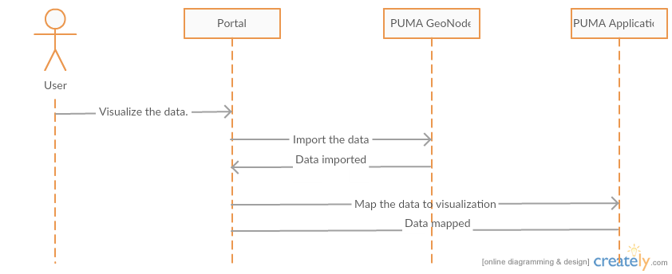
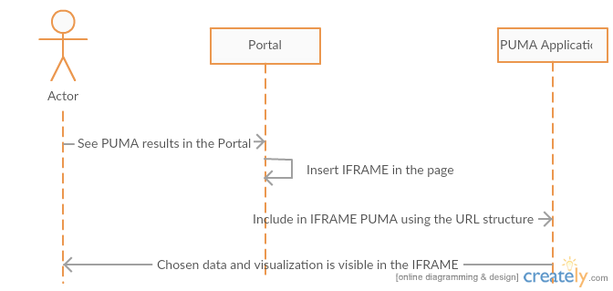
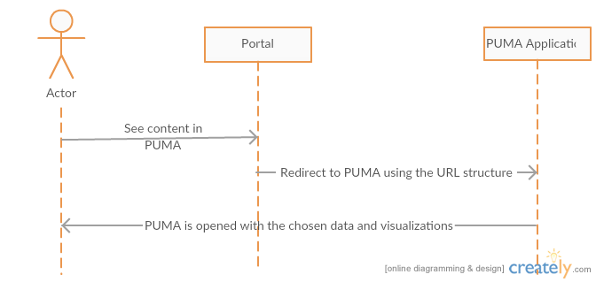

.. _design_uc01_index :

Query and Access Existing Thematic Content
==========================================

This use case aims at using TEP Urban for user exploration of the registered thematic data collection, visualize, share and download them.

.. _design_uc01_dds :

Data discovery and selection
----------------------------

The first step for the user is to discover and search dataset in :ref:`class_terradue_1_1_tep_1_1_collection` within :ref:`class_terradue_1_1_tep_1_1_thematic_application`.

The following first figure depicts this step using the integrated geobrowser of the portal and the basic visualization functions.

.. uml::
  :caption: Data discovery, query, visualization and selection on portal geobrowser
  :align: center

  actor "User" as U
  participant "Portal" as P
  database "Portal database" as PDB
  database "Catalogue" as C
  participant "Feature Server" as FS
  
  autonumber
  
  U -> P : Query Thematic Application
  activate P
  P <-> PDB : Load Thematic Applications items
  PDB -> P : Data Collections, Services, Maps, Features...
  P -> U : Thematic Application
  deactivate P

  U -> P : Query Collection with params (AOI, timespan, filters...)
  activate P
  P -> C : Query catalogue index of the collection
  C -> P : Datasets metadata (atom, geojson...)
  P -> FS : Get visualization features (WMS, WFS, TMS...)
  FS -> P : return features
  P -> U : Datasets information and visualization features
  deactivate P

Next figure depicts the next step that consists of selecting and saving a dataset selection. Then download or share the full selection.

.. uml::
  :caption: Data selection, download and share on portal geobrowser sequence diagram
  :align: center

  actor "User" as U
  participant "Portal" as P
  database "Portal database" as PDB
  database "Catalogue" as C
  participant "Feature Server" as FS
  participant "Data Gateway" as DG
  database "Data Provider" as DP

  U -> P : Select datasets in the basket
  U -> P : Save basket as a data package
  activate P
  P <-> PDB : Save user data package
  P -> U : Data package
  deactivate P

  U -> P : Download data package
  P -> U : redirect to DG
  U -> DG : download data package
  activate DG
  DG <-> P : query data package
  DG <-> C : query the possible locations
  DG -> DG : resolve the best locations
  DG -> U : download links (direct, metalink)
  deactivate DG

  alt Partnership policy 1 or 2

  U <-> DG : Download files

  else Partnership policy 3

  U <-> DP : Download files

  end

.. _design_uc01_puma :

Data visualization using PUMA
-----------------------------

Next figure depicts the same use case but using PUMA for the data vizualisation and manipulation.

Preparation of data for PUMA
~~~~~~~~~~~~~~~~~~~~~~~~~~~~

The process of visualization of the data inside the PUMA consists of three parts. First part is uploading the data into
the PUMA. Second is mapping uploaded data to visualization concepts available to the user in the PUMA visualization
interface. Third is either redirecting user to the PUMA visualization interface or integrating it into current state for
example via iframe. As a part of the third step it is necessary to allow specification of visible part of the interface
in the PUMA.

For the first part there is already available interface in the GeoServer component of the PUMA. This step consists of
creating a data store using GeoServer REST API

- http://docs.geoserver.org/stable/en/user/rest/api/datastores.html. This supports shp, properties, h2, spatialite and appschema.
- http://docs.geoserver.org/stable/en/user/rest/api/coveragestores.html. This supports geotiff, worldimage and imagemosaic.

If we need to support additional formats we will need to decide how to integrate them further down the line. It is
possible to support postGIS database by allowing access to a database, which will be mapped in the GeoServer upfront
manually. For other formats there will be some development effort needed.

  Data insertion into PUMA sequence diagram

For the second step we will need to expose the API, which allows the Portal to map the data to the visualization
concepts used inside of the PUMA. This is currently done manually in the GUI. To allow this we need to expose API for
this mapping. This needs to be done as a part of the development phase.

  Integration into PUMA sequence diagram

For the third step we will need to prepare and document the URL structure, which will contain the information about the
User Interface, its state and the visualizations which will be visible by default for the user.

  Redirection to PUMA sequence diagram

Capabilities of PUMA with respect to visualization
~~~~~~~~~~~~~~~~~~~~~~~~~~~~~~~~~~~~~~~~~~~~~~~~~~

PUMA focuses on showing the visualized data in right contexts. Second important part is to visualize them using tools
which will be accessible to as many people as possible. This is achieved by the combination of layers with charts
overlayed on top of the map.

In PUMA it is possible to overlay multiple layers on top of each other to get more complex image of the whole situation.
It is also possible to filter all the available information based on the Area of interest, Attributes, Scope and Layers.
In order to deliver maximum possible value it also allows user to see charts depicting the changes of the values over the
time.

.. uml::
  :caption: Data discovery, query, visualization and combination on PUMA
  :align: center

  actor "User" as U
  participant "Portal" as P
  database "Portal database" as PDB
  database "PUMA" as PUMA
  
  autonumber

  U -> P : Select Data Set for the exploration in PUMA
  U -> P : Visualize chosen data set in PUMA
  activate P
  P -> PUMA : Choose data set
  P -> PUMA : Prepare the default visualization for user
  P -> U : Redirect to PUMA
  deactivate P

  activate PUMA
  PUMA -> U : Interface with chosen data set and default visualizations
  U -> PUMA : Show Additional Charts about the data
  PUMA -> U : Showing the additional charts
  U -> PUMA : Filter the data set by year
  PUMA -> U : Showing filtered data set.
  U -> PUMA : Show another layer on top of current as overlay
  PUMA -> U : Showing layer on top of current
  deactivate PUMA

Simplified integration of the custom data sets into the PUMA
~~~~~~~~~~~~~~~~~~~~~~~~~~~~~~~~~~~~~~~~~~~~~~~~~~~~~~~~~~~~

The User Interface of the tool supports the option to integrate custom data set to the currently selected Scope. The
data set must be in the form of zipped shapefile or geotiff, which may be either plain or zipped. In this way it is
possible to integrate custom data sets from outside of the TEP Urban or from new processors deployed to the TEP Urban
platform.

This integration does three things with respect to the custom analysis in the PUMA. It makes the data set available for
the visualisation with default style. If the user wants custom styles, it is necessary to go to the administration part
of the tool and create them over there. It takes the analytical units in the current scope and run a zonal analysis for
all the units available in given scope. All the attributes available in the data set are summed and averaged for the
administrative units and make available as attributes for the usage in choropleths and charts.

.. uml::
:caption: Simplified integration of data set in the PUMA.
        :align: center

        actor "User" as U
        participant "PUMA" as P

        autonumber

        U -> P : Explore chosen thematic contents
        activate P
        U -> P : Upload and integrate new data set.
        P -> U : Loading and integrating.
        P -> U : Integration finished
        U -> P : Display the new layer
        P -> U : New layer displayed
        U -> P : Create a chart showing the attributes
        P -> U : New chart created and displayed
        deactivate P
