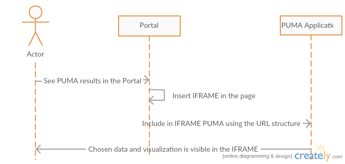
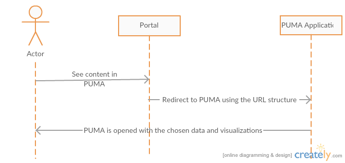

.. _design_uc04 :

Combine, Analyse and Visualise Data, Products and Results
=========================================================

In this user scenario, a previous user data selection may be enhanced using GIS tools.

It is then assumed the user has made a data selection within a data package as described in :ref:`design_uc01`.

Preparation of data for PUMA
~~~~~~~~~~~~~~~~~~~~~~~~~~~~

The process of visualization of the data inside the PUMA consists of three parts. First part is uploading the data into
the PUMA. Second is mapping uploaded data to visualization concepts available to the user in the PUMA visualization
interface. Third is either redirecting user to the PUMA visualization interface or integrating it into current state for
example via iframe. As a part of the third step it is necessary to allow specification of visible part of the interface
in the PUMA.

For the first part there is already available interface in the GeoServer component of the PUMA. This step consists of
creating a data store using GeoServer REST API

- http://docs.geoserver.org/stable/en/user/rest/api/datastores.html. This supports shp, properties, h2, spatialite and appschema.
- http://docs.geoserver.org/stable/en/user/rest/api/coveragestores.html. This supports geotiff, worldimage and imagemosaic.

If we need to support additional formats we will need to decide how to integrate them further down the line. It is
possible to support postGIS database by allowing access to a database, which will be mapped in the GeoServer upfront
manually. For other formats there will be some development effort needed.

.. figure:: puma/insertDataToPuma.png

      Data insertion into PUMA sequence diagram

For the second step we will need to expose the API, which allows the Portal to map the data to the visualization
concepts used inside of the PUMA. This is currently done manually in the GUI. To allow this we need to expose API for
this mapping. This needs to be done as a part of the development phase.

      Integration into PUMA sequence diagram

For the third step we will need to prepare and document the URL structure, which will contain the information about the
User Interface, its state and the visualizations which will be visible by default for the user.

      Redirection to PUMA sequence diagram

Capabilities of PUMA with respect to visualization
~~~~~~~~~~~~~~~~~~~~~~~~~~~~~~~~~~~~~~~~~~~~~~~~~~

PUMA focuses on showing the visualized data in right contexts. Second important part is to visualize them using tools
which will be accessible to as many people as possible. This is achieved by the combination of layers with charts
overlayed on top of the map.

In PUMA it is possible to overlay multiple layers on top of each other to get more complex image of the whole situation.
It is also possible to filter all the available information based on the Area of interest, Attributes, Scope and Layers.
In order to deliver maximum possible value it also allows user to see charts depicting the changes of the values over the
time.

.. uml::
      :caption: Data discovery, query, visualization and combination on PUMA
      :align: center

      actor "User" as U
      participant "Portal" as P
      participant "GIS" as GIS

      autonumber

      U -> P : Explore chosen thematic contents
      activate P
      P -> GIS : Visualize selected Thematic Content
      deactivate P

      activate GIS
      GIS -> U : Visualized thematic content over the map
      U -> GIS : Filter the data based on the year
      GIS -> U : Filtered data
      U -> GIS : Show me Italy
      GIS -> U : Focus is moved to the Italy
      U -> GIS : Display another layer on top of current
      GIS -> U : Another layer displayed
      U -> GIS : Zooming in and on the map
      U -> GIS : Moving over the map
      deactivate GIS

Simplified integration of the custom data sets into the PUMA
~~~~~~~~~~~~~~~~~~~~~~~~~~~~~~~~~~~~~~~~~~~~~~~~~~~~~~~~~~~~

The User Interface of the tool supports the option to integrate custom data set to the currently selected Scope. The
data set must be in the form of zipped shapefile or geotiff, which may be either plain or zipped. In this way it is
possible to integrate custom data sets from outside of the TEP Urban or from new processors deployed to the TEP Urban
platform.

This integration does three things with respect to the custom analysis in the PUMA. It makes the data set available for
the visualisation with default style. If the user wants custom styles, it is necessary to go to the administration part
of the tool and create them over there. It takes the analytical units in the current scope and run a zonal analysis for
all the units available in given scope. All the attributes available in the data set are summed and averaged for the
administrative units and make available as attributes for the usage in choropleths and charts.

.. uml::
      :caption: Simplified integration of data set in the PUMA.
      :align: center

      actor "User" as U
      participant "PUMA" as P

      autonumber

      U -> P : Explore chosen thematic contents
      activate P
      U -> P : Upload and integrate new data set.
      P -> U : Loading and integrating.
      P -> U : Integration finished
      U -> P : Display the new layer
      P -> U : New layer displayed
      U -> P : Create a chart showing the attributes
      P -> U : New chart created and displayed
      deactivate P