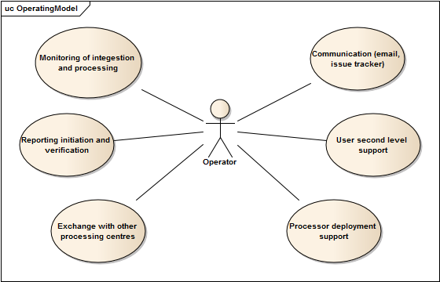

.. _bcpc_part1 :

BC Urban TEP Operating
======================

.. req:: TS-FUN-750
  :show:

  (Custom algorithm upload support) Urban TEP Processing Centre Operating provides support for the integration of user-provided processors on request via the Portal Issue Tracking system.

.. req:: TS-FUN-760
  :show:

  (Issue tracking) Urban TEP Processing Centre Operating regularily handles issues assigned to the BC processing centre in the Portal Issue Tracking system.

.. req:: TS-FUN-620
  :show:

  (Data ingestion monitoring) Operating initiates and monitors ingestion of datasets from data providers performed by the Urban TEP Processing and Ingestion Control.

.. req:: TS-FUN-630
  :show:

  (Dataset exchange) Operating performs the exchange of datasets and processors with the other Processing Centres. 

.. req:: TS-FUN-670
  :show:

  (Processing) Operating monitors processing.

.. req:: TS-FUN-680
  :show:

  (Deployment) Operating maintains the versions of Urban TEP processors in the Urban TEP Config & Processor Repo and installs them on the Calvalus cluster. 

.. req:: TS-FUN-690
  :show:

  (Processing result provision) Operating performs cleanup of results stored at Online Data Access/FTP for a certain time. Operating is also involved in the process of releasing a dataset as permanent (like an input or a reference dataset).

.. req:: TS-FUN-710
  :show:

  (Processing statistics) Operating initiates and verifies the report generated with the Urban TEP Processing and Ingestion Control.

.. req:: TS-FUN-720
  :show:

  (Reference data upload) Operating supports reference data upload if the data is provided by FTP.

.. req:: TS-FUN-740
  :show:

  (Software upload) Operating verifies user-provided processor bundles and installs them either in the user-specific area or for public use.

.. req:: TS-RES-630
  :show:

  (Subsystem configuration) Operating maintains the Urban TEP processors and processor versions, system configurations for queue resources, online data access space, and systematic workflows in the Configuration and Processor Repository.

.. req:: TS-ICD-240
  :show:

  (Email Interface) Operating has a dedicated email account urbantep@brockmann-consult.de .

.. req:: TS-ICD-250
  :show:

  (Processor and Data Exchange Interface) The Online data access/FTP shall expose an (S)FTP interface to exchange data and processors between processing centres.

.. req:: TS-ICD-350
  :show:

  (Resource utilization reporting interface) Operating initiates and verifies report generated by Ingestion and Processing Control.

.. req:: TS-ICD-090
  :show:

  The operator monitors - and initiates for bulk processing - the generation of catalogue entries by Ingestion and Processing Control.
 	 	 
.. req:: TS-ICD-140
  :show:	

  (Issue Tracking web widget) Urban TEP Processing Centre Operating regularily handles issues assigned to the BC processing centre in the Portal Issue Tracking system. 

   *Operating use cases*

Personnell
----------

The Urban TEP BC processing centre will be managed by the Calvalus operator with some Urban TEP-specific activities. 

 * An email account urbantep@brockmann-consult.de serves as communication endpoint.
 * The BC processing centre has an account in the Urban TEP portal issue tracking system.

Information persistence
-----------------------

Operators exchange information that is kept persistent:

 * The issue tracking keeps track of all communication activities regarding the BC processing centre. 
 * The record of emails keeps track of bilateral communication.
 * For private infomation a wiki document within the BC wiki (Confluence) is maintained. If necessary specific operational procedures inside the BC processing centre are documented here.

Service and functions
---------------------

Activities of the Operator comprise:

 * monitoring of ingestion
 * communication with data providers, configuration for new ingestion sources (new datasets, different extent, different time interval)
 * monitoring of processing, analysis of failures
 * support of users in case of issues assigned to the BC processing centre
 * support of well-known users for the integration and upload of processors (and reference datasets if necessary)
 * communication with the Portal Operating and with Operating of the other processing centres, exchange of datasets and processors
 * initiation and configuration for bulk processing in case of the systematic generation of a new product in the Urban TEP
 * initiation of reporting, verification of reports
 * data management, initiation of cleanup of old results

Interfaces and interface items
------------------------------

The external interfaces provided or used by Operating are:

 * The Operating provides an email interface
 * The Operating uses the issue tracking interface of the Portal
 * The Operating uses the online data access interfaces of other proessing centres (to exchange datasets or processors)

The internal interfaces within the BC processing centre used by Operating are:

 * The scripting and configuration interfaces of the Ingestion and Processing Control
 * HDFS and NFS interfaces of the HDFS EO Data and Processing Storage for data management, installation of processors, change of access rights
 * Versioning interface of Configuration and Processor Repository
 * NFS interface of Online Data Access for user support, exchange with other processing centres, and data management of the staging area
 * Monitoring and control interfaces, log files etc. of all components

